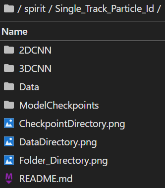
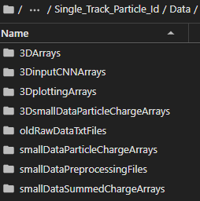
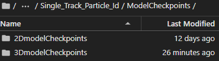

# Single Track Particle Id
## Introduction
This repository contains code to train and make predictions on simulated particle tracks from the Spirit TPC. The model architectures used are 2D Convolutional Neural Networks (2D CNN), 3D Convolutional Neural Networks (3D CNN), and PointNet. Linked [here](https://groups.nscl.msu.edu/hira/cosmic/SpiritTPC.html) is more information about the actual detector, the SAMURAI Pion Reconstruction and Ion Tracker Time Projecting Chamber (SπRIT TPC). 

## Directory Structure
(_TODO: This is potentially out-of-date and needs to be updated_)
The general directory is structured like this. The `Data` folder and `ModelCheckpoints` folder are not in the GitHub repository, but will be created by the code in the repository.



### Data
To get the raw data `oldRawDataTxtFiles`, you will likely need to ask Michelle or Raghu for help. There was issues with trying to get the raw data due to permissions.

The data will be organized so all the data files are under one single folder ‘Data’. The data is not in the repository because it would take up too much space. The data is organized in the following directory structure:



--→ `3DArrays` (Arrays for general use. Data is sorted into their particles without randomization. Array format: "[x, y, z, charge]")

--→ `3DinputCNNArrays` (Arrays formatted for 3DCNN use. Data is seperated into test and train inputs and labels.)

--→ `3DplottingArrays` (Arrays contain only points with charge data. Array format: "[x, y, z, charge]")

--→ `3DsmallDataParticleChargeArrays` (Arrays created from txt_to_numpy_array_3D.py. The arrays are only used for further processing.)

--→ `oldRawDataTxtFiles` (Original .txt files of the simulated data. All data originates from these .txt files)

--→ `smallDataParticleChargeArrays` (Arrays created from txt_to_numpy_array.py. The arrays are only used for further processing.)

--→ `smallDataPreprocessingFiles` (Arrays formatted for 2DCNN use. Data is seperated into test and train inputs and labels.)

--→ `smallDataSummedChargeArrays` (Arrays created from sum_pads_arrays.py. The arrays are only used for further processing.

### ModelCheckpoints
The `ModelCheckpoints` folder stores all the checkpoints, learning curves, and confusion matrices for each instance of model training.



## Dependencies
Set up a virtual enviroment for the running of the code, as there are several dependencies required in the code. I used anaconda, but pip or any other virtual enviroment system should be similiar. Here are a list of the python packages require to be installed for running the code:

- `click`
- `jupyterlab`
- `matplotlib`
- `numpy`
- `python`
- `scikit-learn`
- `tensorflow-gpu`
- `tqdm`
- `scipy`
- `sparse (conda-forge)`

Please go into the readme file in `PointNet` folder for further instructions on implementation

The package `sparse` is installed through conda forge, and thus will need to be installed on anaconda with the following code:

```conda install -c conda-forge sparse```

I am not familiar with how to install it through pip. See if you can install it directly without forge.

## Code Usage
The workflow for the code is different for 2D CNN, 3D CNN and PointNet. Go into each respective folder for more information.
# particle_track_idetification
